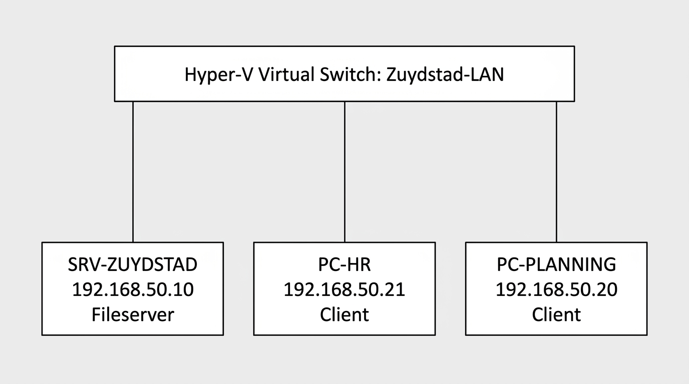

Netwerkontwerp – Challenge 10 (Hyper-V)
======================================

Dit document hoort bij **Challenge 10 – Virtualiseren met Hyper‑V**. Het is een ontwerp dat je 1-op-1 kunt nabouwen in Hyper‑V.

## 1. Doel van het netwerk

We bouwen een kleine, veilige testomgeving voor **Zuydstad Zorgdiensten B.V.** met:

- 1× **Windows Server 2025** als **fileserver**
- 2× **werkstations** (Windows 11) om te testen of:
  - de server bereikbaar is (ping)
  - gedeelde mappen werken
  - rechten kloppen (wel/niet toegang)

## 2. Onderdelen (VM’s)

| VM-naam         | Rol                 | Besturingssysteem       | Opmerking |
|-----------------|---------------------|--------------------------|----------|
| `SRV-ZUYDSTAD`  | Fileserver          | Windows Server 2025      | Shares + rechten + gebruikers |
| `PC-HR`         | Werkstation HR       | Windows 11               | Test met HR-account |
| `PC-PLANNING`   | Werkstation Planning | Windows 11               | Test met Planning-account |

## 3. Virtueel netwerk in Hyper-V

Maak één virtuele switch:

- **Naam**: `Zuydstad-LAN`
- **Type**: *Private* (aanbevolen) of *Internal* (als je ook vanaf de host wilt pingen/testen)

**Waarom Private/Internal?** Je oefent veilig zonder dat je VM’s direct op het echte schoolnetwerk zitten.

## 4. IP-plan (voorbeeld)

Gebruik één subnet. Dit is een simpel voorbeeld dat je docent mag aanpassen.

- **Subnet**: `192.168.50.0/24`
- **Subnetmask**: `255.255.255.0`

| VM              | IP-adres         |
|-----------------|------------------|
| `SRV-ZUYDSTAD`  | `192.168.50.10`  |
| `PC-HR`         | `192.168.50.21`  |
| `PC-PLANNING`   | `192.168.50.20`  |

**Gateway/DNS**

- Bij een *Private/Internal* netwerk heb je **geen internet**. Een gateway is dan niet nodig.
- Als je docent toch internet wil: gebruik een *External* switch en vul gateway/DNS in zoals de docent aangeeft.

## 5. Bestandsstructuur op de server (zoals Challenge 9)

Op `SRV-ZUYDSTAD` maak je de map:

- `C:\\Zuydstad_Zorgdiensten`

Met submappen:

- `01_Algemeen`
- `02_Planning`
- `03_HR_Dossiers`
- `04_Financien`
- `05_Management`
- `06_IT_Backup`

## 6. Share-ontwerp (delen)

Deel de hoofdmap als share, bijvoorbeeld:

- **Share naam**: `Zuydstad_Zorgdiensten`
- **Pad**: `C:\\Zuydstad_Zorgdiensten`
- **Netwerkpad (UNC)**: `\\\\SRV-ZUYDSTAD\\Zuydstad_Zorgdiensten`

> Tip: Gebruik één share op de hoofdmap. Daarna regel je de toegang vooral met NTFS‑rechten per submap.

## 7. Rollen (groepen) en accounts (voor test)

Maak minimaal deze groepen op de server:

- `HR`
- `Planning`
- `Financien`
- `Management`
- `IT`

Maak minimaal twee testaccounts (meer mag ook):

- HR‑gebruiker (bijv. `fatima` → groep `HR`)
- Planning‑gebruiker (bijv. `sanne` → groep `Planning`)

## 8. Rechten (hoog niveau)

Het doel is: **samenwerken kan**, maar **gevoelige mappen zijn afgeschermd**.

Voorbeeld (globaal):

- `01_Algemeen`: iedereen lezen, sommige wijzigen
- `02_Planning`: alleen Planning + Management
- `03_HR_Dossiers`: alleen HR + Management + IT
- `04_Financien`: alleen Financien + Management + IT
- `05_Management`: Management (+ eventueel lezen voor anderen als je dat uitlegt)
- `06_IT_Backup`: alleen IT

> Werk met NTFS‑rechten per map. Share‑rechten houd je simpel (bijv. alleen geauthenticeerde gebruikers toegang).

## 9. Testplan (bewijs voor het verslag)

Vanaf `PC-HR`:

- Ping `192.168.50.10`
- Open `\\SRV-ZUYDSTAD\Zuydstad_Zorgdiensten`
- Controleer: **wel** toegang tot `03_HR_Dossiers`, **geen** toegang tot `02_Planning` (als je dat zo instelt)

Vanaf `PC-PLANNING`:

- Ping `192.168.50.10`
- Open `\\SRV-ZUYDSTAD\Zuydstad_Zorgdiensten`
- Controleer: **wel** toegang tot `02_Planning`, **geen** toegang tot `03_HR_Dossiers`

Maak van elke stap een screenshot.

## 10. Schema

